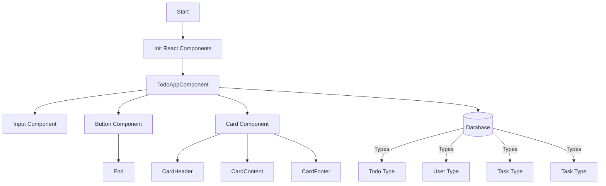

# TodoApp

## Introduction
TodoApp is a simple application designed to help users manage their tasks efficiently.

## Features
- Add, edit, and delete tasks
- Set priorities for tasks
- Due date reminders

## Getting Started
Clone the repository and open the project in your preferred IDE to begin developing.

## Components Overview (Mermaid Diagram)

## License
This project is licensed under the MIT License - see the LICENSE file for details.

## Hello World
